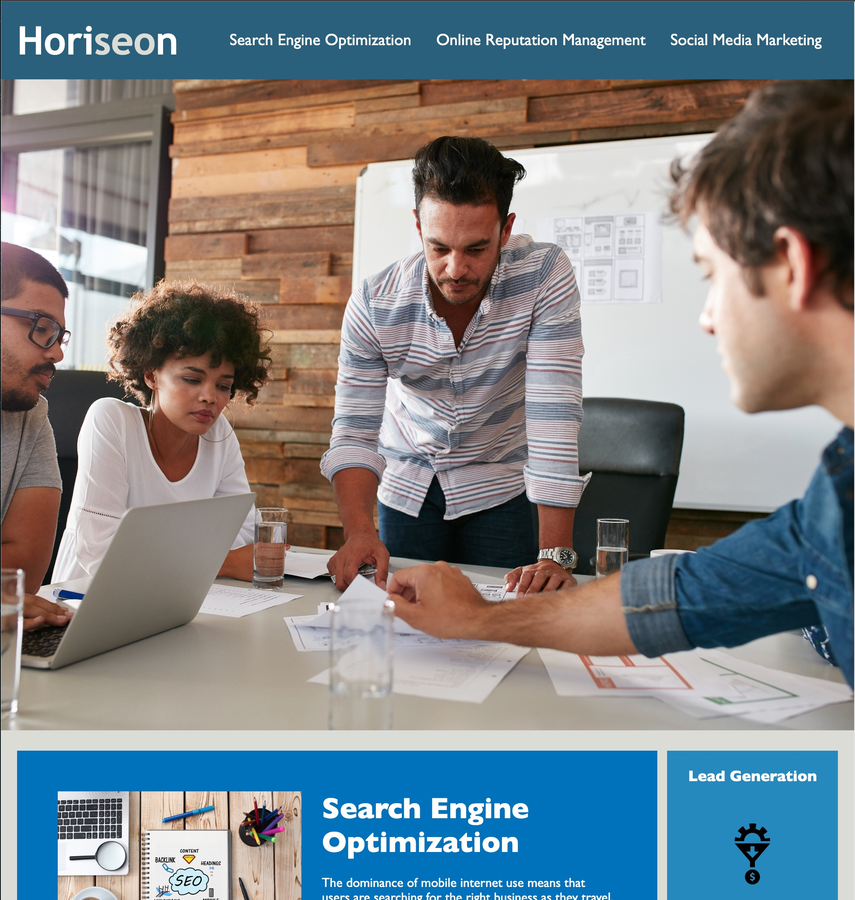
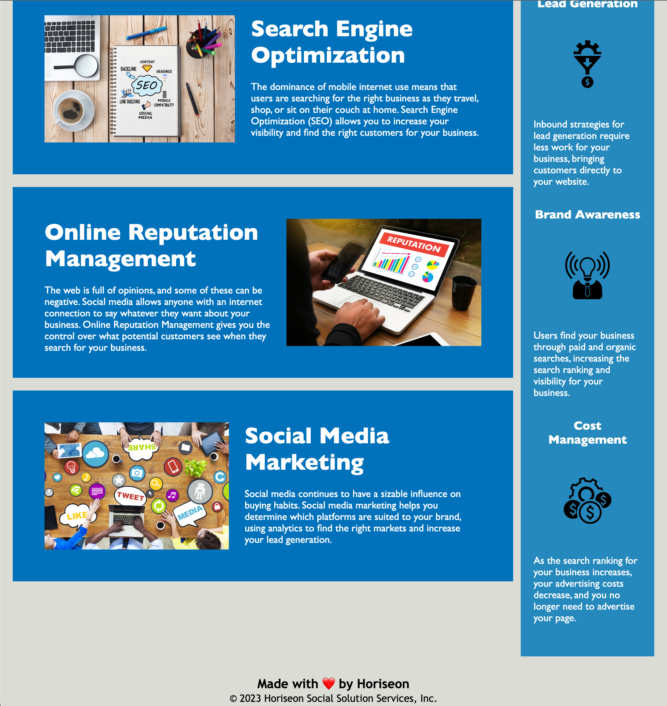

# Horiseon Webapp Code Refactoring

## Description

This project is an effort to refactor existing code (html & css) for Horiseon Social Solution Services, Inc.:

- The project was launched in an effort to reorganize existing code that was unorganized and confusing. This was done by using semantic html elements, using alt tags, condensing css, and reorganizing both the html and css to be easier to work with and more closely follow best practices.
- With the code being refactored, the webapp is now more accessible to frontend users and better organized for future work on the backend. 
- Throughout this project, I gained experience working with and making changes to existing code in order to provide a more polished end product.

## Usage

[Visit the Horiseon webapp here.](https://abealberts.github.io/horiseon-accessibility-rework/)

Screenshots:

